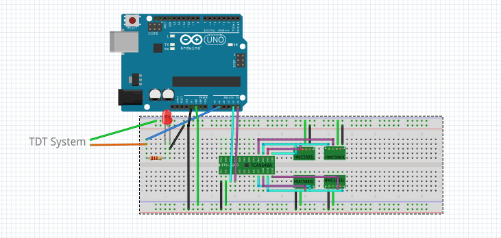

# magnetometer-data
Meant to collect limb data from small magnets attached to pup that are placed above four QMC5883L magnetometers. The Arduino also features a TCA9548A I2C multiplexer to manage the four identical magnetometers. This also communicates with the Tucker Davis Technologies RZ2 to display when the data collection is active. 

Circuit "Schematic":
(Ideally this will be updated when I decide to create Fritzing IC's for the QMC5883L and the TCA9548A)

